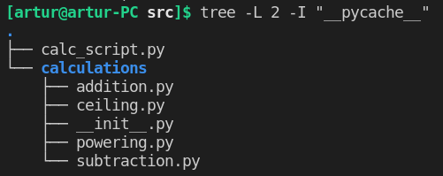
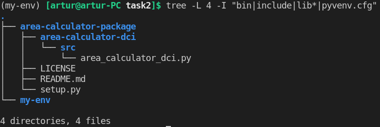
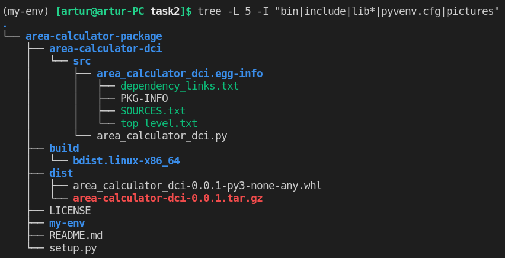

# Python Tools and Libraries

## Creating packages 

In this exercise, we will focus on creating own packages, both locally and on PyPI.
 
## 

## Tasks

### 

### :heavy_plus_sign: Task 1 - calculation package 

Your task is to create Python package called `calculations`, that should consist of at least 4 modules.  
Every module should be responsible for one distinct mathematical operations (addition, subtraction, etc.).  
In your modules you can use modules from Python Standard Library (for example `math` module).  
Next to the package write Python script, that uses aforementioned modules to do some calculations.  
>Hint: Remember about `__init__.py` file inside package folder!

- Your script code could look like this:


```python
from calculations.addition import sum_operation as a
from calculations.subtraction import minus_operation as s

# Your further code
```
- Your files structure could look like this:



- Your results could look like this:

```
Result of addition is 8
Result of subtraction is -2
Result of ceiling is 1
Result of powering is 16
``` 

### :heavy_plus_sign: Task 2 - creating package on PyPI

Your task is to create your own Python package and publish it on PyPI.  
Read and analyze following steps of publishing package.  
>Think about the job that your package could do!  

Prepare your package in a similar way.  
Make modifications, create newer versions of your package to gain more experience :smiley:


#### **1. Write your Python module and save it under a directory**
- Official [tutorial](https://packaging.python.org/tutorials/packaging-projects/) of packaging Python projects.  
- You should first decide the name of your package and then create the directory with the name of the package.  
- Our working directory name is `area-calculator-package`, all files and folders of the package are inside of it. 
- Create virtaual environment and activate it. In this example name of virtualenv is `my-env`.
- In this example we are going to publish a package with the name `area-calculator-dci`, so the directory should be of the same name. 
- Create another subdirectory with the name `src` under it and place a `area_calculator_dci.py` file under the src subdirectory.
- Additionally, you should also include a `setup.py` file, a `README.md` and a LICENSE file under the root directory for your project. 
- At this time, your project structure should look something as below:  



- To keep things simple, we will write a few simple methods in  `area_calculator_dci.py` file to be called after importing:  

```python
from math import pi 


def welcome():
    print('Hello, welcome to area calculator package!')

def square(a):
    return a * a

# etc.
```


#### **2. Create the `setup.py` file with necessary information**
- [Summaries and links](https://packaging.python.org/key_projects/#setuptools) for the most relevant projects in the space of Python installation and packaging.  

- `setuptools` (which includes `easy_install`) is a collection of enhancements to the Python `distutils` (the original Python packaging system, added to the standard library in Python 2.0.) that allow you to more easily build and distribute Python distributions, especially ones that have dependencies on other packages.
- `setup.py` is the build script for `setuptools`. It tells setuptools about your package (such as the name and version) as well as which code files to include.  
- setup() takes several arguments. Read about minimal set of them in the section [Configuring metadata](https://packaging.python.org/tutorials/packaging-projects/) of official packaging tutorial. 
- In our example `setup.py` looks as follows:  
```bash
import setuptools

with open("README.md", "r") as fh:
    long_description = fh.read()

setuptools.setup(
    name="area-calculator-dci",                             # This is the name of the package
    version="0.0.1",                                        # The initial release version
    author="Artur Zacniewski",                              # Full name of the author
    description="Calculate areas of geometrical figures",
    long_description=long_description,                      # Long description read from the the readme file
    long_description_content_type="text/markdown",
    packages=setuptools.find_packages(),                    # List of all python modules to be installed
    classifiers=[
        "Programming Language :: Python :: 3",
        "License :: OSI Approved :: MIT License",
        "Operating System :: OS Independent",
    ],                                                      # Information to filter the project on PyPi website
    python_requires='>=3.6',                                # Minimum version requirement of the package
    py_modules=["area_calculator_dci"],                     # Name of the python package
    package_dir={'':'area-calculator-dci/src'},             # Directory of the source code of the package
    install_requires=[]                                     # Install other dependencies if any
)
```

#### **3. Choose a LICENSE and provide a README file for your project**
- `long_description` from `setup.py` is a detailed description of the package. This is shown on the package detail page on the Python Package Index. In this case, the long description is loaded from README.md, which is a common pattern.
- You can read more about licensing from this [GitHub link](https://docs.github.com/en/github/creating-cloning-and-archiving-repositories/creating-a-repository-on-github/licensing-a-repository). 
- [Here](https://choosealicense.com/) you can choose license for your project.  
- [MIT license](https://choosealicense.com/licenses/mit/) example rady to copy and paste to your LICENSE file.

#### **4. Generate the distribution archives on local machine**
- Now that the code for the python package is almost complete, you can start building the distribution archives. 
- Archives are compressed files that help your package to be deployed across multiple platforms and also make it platform independent. 
- In order to generate the distribution archives, run the following command from your terminal:  
```bash
pip install -U pip
pip install -U setuptools wheel
```
- Above commands will upgrade your setuptools library on your machine to use the latest version. 
- After this, you need to run the following command from the root directory of your package to generate the distribution files:  

```bash
python setup.py sdist bdist_wheel
```
- Once you run the above command, you can see that the distribution packages will be delivered under the directories — `build` and `dist`, that are newly created as below. 
- In addition to that, you can also see that the `egg` file information has been updated in the project source code as well:



#### **5. Try installing the package on your local machine**
- Now that we have our distribution files ready, we can go ahead and try installing and importing the package to test if it works fine.
-  In order to install the package on your local machine, we should run the following commands from the root directory:  

```bash
(my-env) [artur@artur-PC area-calculator-package]$ pip install -e .
Obtaining file:///home/artur/Desktop/DCI/MY-REPOS-ON-DCI/Python-Tools-and-Libraries-creating_packages/src/task2/area-calculator-package
Installing collected packages: area-calculator-dci
  Running setup.py develop for area-calculator-dci
Successfully installed area-calculator-dci-0.0.1
(my-env) [artur@artur-PC area-calculator-package]$ python
Python 3.9.6 (default, Jun 30 2021, 10:22:16) 
[GCC 11.1.0] on linux
Type "help", "copyright", "credits" or "license" for more information.
>>> import area_calculator_dci
>>> area_calculator_dci.welcome()
Hello, welcome to area calculator package!
>>> area_calculator_dci.square(5)
25
>>> 
```  
- As you can see above, in the first step we installed the package locally using the given command and once it is installed, we start the python shell and import it. 
- Then we call the package methods and it prints the results to the terminal.

#### **6. Publish the package to the TestPyPi repository to check if all works well**
- Once the package is installed on local and works fine, it is now ready to be shipped to the [TestPyPi](https://test.pypi.org/) repository. 
- This is a **test** repository for all Python packages to test and see if all code works fine and there are no issues within the package code. 
- This keeps it isolated from the official PyPi repository and makes sure that only thorough tested packages are deployed to production.  
- Navigate to TestPyPi page and register yourself as an user. Once you are registered, open your terminal and run the following command:  
 ```bash
 pip install -U twine
 ```

- This will install a package called [twine](https://twine.readthedocs.io/en/latest/) on your machine that will help ship the Python package to the repositories.  
- After the `twine` package is installed, run the following command to ship the code to TestPyPi first. 
```bash
twine upload --repository-url https://test.pypi.org/legacy/ dist/*
```
- You can encounter errors, for example like this:  
```bash
HTTPError: 400 Bad Request from https://test.pypi.org/legacy/
This filename has already been used, use a different version. See https://test.pypi.org/help/#file-name-reuse for more information.
```
Don't worry about it. Read carefully error information and make a correction :smiley:
>Note: when you change/add some features in your package, remember to generate new version of build (look at point no. 4)!  

- When you run the command, you will be asked to provide the same credentials using which you have registered your account in the previous step.


- As you can see in the figure above, the python package has now been shipped to the TestPyPi repository and you can view it from the URL link in the terminal.  
- Also under the given link you have information how to install your package from TestPyPI.  
- In order to install the package from the test repository, first we will uninstall the already existing package and then run the following command to install it.
```bash
pip uninstall area-calculator-dci
pip install -i https://test.pypi.org/simple/ area-calculator-dci
```

The result of these two commands:  
```bash
(my-env) [artur@artur-PC area-calculator-package]$ pip uninstall area-calculator-dci 
Found existing installation: area-calculator-dci 0.0.2
Uninstalling area-calculator-dci-0.0.2:
  Would remove:
    /home/artur/Desktop/DCI/MY-REPOS-ON-DCI/Python-Tools-and-Libraries-creating_packages/src/task2/area-calculator-package/my-env/lib/python3.9/site-packages/area-calculator-dci.egg-link
Proceed (Y/n)? y
  Successfully uninstalled area-calculator-dci-0.0.2
(my-env) [artur@artur-PC area-calculator-package]$ pip install -i https://test.pypi.org/simple/ area-calculator-dci
Looking in indexes: https://test.pypi.org/simple/
Collecting area-calculator-dci
  Downloading https://test-files.pythonhosted.org/packages/40/30/42b56d5128667ec2e8eac6a4024f949d60e67000cc36a3ea722bbb5d4f94/area_calculator_dci-0.0.2-py3-none-any.whl (2.7 kB)
Installing collected packages: area-calculator-dci
Successfully installed area-calculator-dci-0.0.2
```

-  The package on the local system is now installed from the TestPyPi repository.

#### **7. Finally, publish the package to the PyPi repository**

- Now that everything works well with our package, it’s time that we can publish it to the official PyPi repository. 
- Follow the same steps to register an account and then run the following command to ship the package to the official repository:  
```bash
twine upload dist/*
```
- When you run the command, you will be asked to provide the same credentials using which you have registered your account in the previous step.


- In order to install the package from the **official** repository, first we will uninstall the already existing package and then run the standard command to install it.
```bash
pip uninstall area-calculator-dci
pip install -i https://test.pypi.org/simple/ area-calculator-dci
```

The result of these two commands:  
```bash
(my-env) [artur@artur-PC area-calculator-package]$ pip uninstall area-calculator-dci
Found existing installation: area-calculator-dci 0.0.2
Uninstalling area-calculator-dci-0.0.2:
  Would remove:
    /home/artur/Desktop/DCI/MY-REPOS-ON-DCI/Python-Tools-and-Libraries-creating_packages/src/task2/area-calculator-package/my-env/lib/python3.9/site-packages/area_calculator_dci-0.0.2.dist-info/*
    /home/artur/Desktop/DCI/MY-REPOS-ON-DCI/Python-Tools-and-Libraries-creating_packages/src/task2/area-calculator-package/my-env/lib/python3.9/site-packages/area_calculator_dci.py
Proceed (Y/n)? y
  Successfully uninstalled area-calculator-dci-0.0.2
(my-env) [artur@artur-PC area-calculator-package]$ pip install area-calculator-dci
Collecting area-calculator-dci
  Downloading area_calculator_dci-0.0.2-py3-none-any.whl (2.7 kB)
Installing collected packages: area-calculator-dci
Successfully installed area-calculator-dci-0.0.2
```
- Now it's your turn :smiley:
